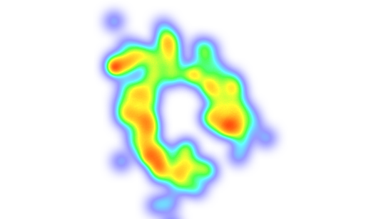
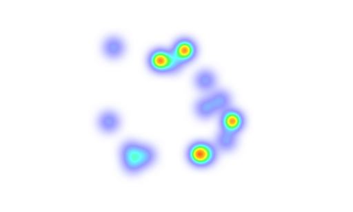

<h1>Coursera Capstone</h1>

<h2>IBM Applied Data Science Capstone</h2>

Opening a New Fitness Club in Moscow, Russia 
By: Alexander Konnov 
April, 2021

Introduction
-----------

This project focuses on the selection of the optimal location for a fitness club in Moscow, Russia.

The review [Forbes](https://www.forbes.ru/biznes/417589-razrushitelnoe-cunami-2020-god-stal-hudshim-za-vsyu-istoriyu-rossiyskoy-industrii) claims that during the pandemic, about 60% of market participants were broken.

Currently, restrictions on visits to offices, shops and entertainment centers, which include fitness clubs, are gradually being lifted. New players are expected to emerge, as well as the return of old customers.

### Business problem

It is necessary to assess the prospects of certain districts of Moscow in terms of placing new fitness clubs there. Using Data Science and clustering methods, it is necessary to prepare answers to the question of where is the most profitable to open a new fitness club.

The report should provide answers to the following questions:

- The most efficient location for a fitness club aimed at office workers

- The most efficient location for a family oriented fitness club.

### Target of this project

The target audience of this project are investors, as well as large networks of fitness centers that want to effectively use their funds in the context of economic recovery.

Data
--

### Data to solve the problem

Data expected to be used in preparing this project:

1. Distribution of population density in Moscow, Russia
2. Distribution of offices and colleges in Moscow, Russia
2. Distribution of gyms in Moscow, Russia

### Data sources and methods to analyze

All these data are available from information about venue data.

First of all we get geographical boundaries of Moscow from [OpenStreetMap](https://www.openstreetmap.org/) and use method Monte Carlo to put random points inside the boundaries. 

OpenStreetMap is built by a community of mappers that contribute and maintain data about roads, trails, cafés, railway stations, and much more, all over the world. 
It emphasizes local knowledge. Contributors use aerial imagery, GPS devices, and low-tech field maps to verify that OSM is accurate and up to date. 
OpenStreetMap's community is diverse, passionate, and growing every day. Our contributors include enthusiast mappers, GIS professionals, engineers running the OSM servers.

The reason of this approach is limitations of gathering data about venue data near the selected points. 

After that, we will use Foursquare API to get the venue data for those points. Foursquare has one of the largest database of 105+ million places. Foursquare API will provide many categories of the venue data.

We will use these categories to estimate the needed data in order to help us to solve the business problem put forward. 

This is a project that will make use of many data science skills, from web scraping (Wikipedia), working with API (Foursquare), data cleaning, data wrangling, to machine learning (K-means clustering) and map visualization (Folium).

Methodology 
-------

We are going to prepare three sets of data:

- The first one based on distribution of groceries. It should give me the distribution of population in Moscow 

- The second one based on distribution of colleges and offices. It should give me the distribution of where people spend their working days

- The third is based on distribution of fitness clubs. It gives the distribution of fitness clubs

Then we'll make the DBSCAN clusterisation for each dataset. The goal of clusterisation is to divide each set in two clusters. The first with high density and the second with low density (outliers). To make it we are going to join all clusters gathered by DBSCAN into the first.

On the next step we are going to compare the density clusters of population and fitness clubs. If somewhere the density of population is high and the density of fitness clubs is low then it's a good place to make new fitness club for families.

Then we are going to compare density clusters of ofices and fitness clubs in the same way. It gives the location where to make new fitness clubs for office workers.

On the last step we use reverse geocoding to restore Address from geolocations to get addresses with lack of gyms.

Data analysis
----

Based on data gathered from Foursqare and DBSCAN clusterization we get the heat map of areas with low population density. 

On the next picture is the heat map of areas with low concentrations of gyms

Compare areas with high population density and low concentrations of gym it's possible to find a suitable place for new gyms

Here are addresses of these places:

- Школа Свиблово, корпус 6, улица Седова, Свиблово, район Свиблово, Москва, Центральный федеральный округ, 129323, Россия
- 46 к2, Новочеркасский бульвар, район Марьино, Москва, Центральный федеральный округ, 109369, Россия
- 9, Тайнинская улица, Лосиноостровский, Лосиноостровский район, Москва, Центральный федеральный округ, 129345, Россия
- 16 к2, Тайнинская улица, Лосиноостровский, Лосиноостровский район, Москва, Центральный федеральный округ, 129345, Россия
- 2044, Люблинская улица (дублёр), Марьинский парк, район Марьино, Москва, Центральный федеральный округ, 109369, Россия

Results and discussion 
-------

Our analysis shows that there are areas with a low density of gyms in Moscow. The lowest concentration is located on the outskirts of Moscow.

These areas roughly correspond, but do not coincide with areas with low population density.

As a result, five areas were found that lacked the availability of gyms for residents.

An area with a high concentration of administrative pressure has also been discovered, which appears to be suitable for a gym.

Conclusion 
-----------

The goal of this project was to identify areas of Moscow that are promising in terms of gyms location, in order to help stakeholders narrow down their search for the optimal location for a new gym. The distributions of gym density, office density, and population density were calculated based on Foursquare data. These locations were then clustered to create major areas of interest (containing the largest number of potential locations) and the addresses of these area centers were generated to be used as starting points for final stakeholder research.

The final decision on the optimal gym location will be made by stakeholders based on the specific characteristics of the neighborhoods and locations in each recommended area, taking into account additional factors such as the attractiveness of each location, prices, etc.